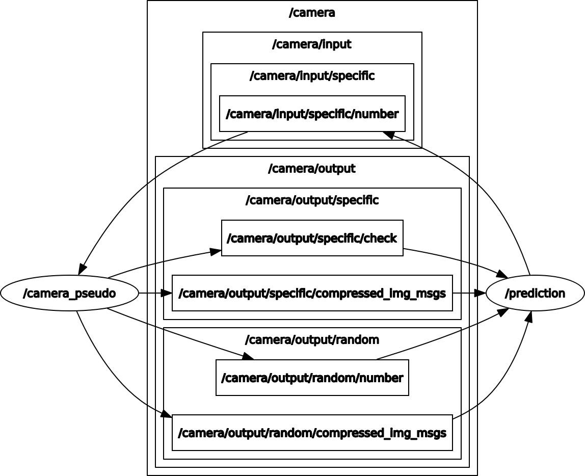

# Excercise ROS + Supervised Learning

This is a repository for the projects realized in the course `AI in Robotics` at University of Applied Science (HTW) Berlin.

Matrikel-Nr: 559842 - Calussi Diletta

The main objective of this project is to get a basic insight on how the publisher/subscriber system works within the ROS environment. A CNN model is implemented in Keras, in order to classify images (based on the MNIST dataset).

There are two nodes: 
- [CameraPseudo](https://github.com/dltcls/ros_ai/blob/master/excercise_1/catkin_ws/src/camera_pseudo/src/CameraPseudo.py): The camera acts either as Publisher and as Subscriber. It manages both fixed number and random number
- [Prediction](https://github.com/dltcls/ros_ai/blob/master/excercise_1/catkin_ws/src/prediction/src/Prediction.py) is a subscriber to all topics where CameraPseudo publishes. Prediction also acts on both fixed and random number

The final system looks like as follows:

A more detailed explanation is in the [SOLUTION.md](SOLUTION.md) file (German).
