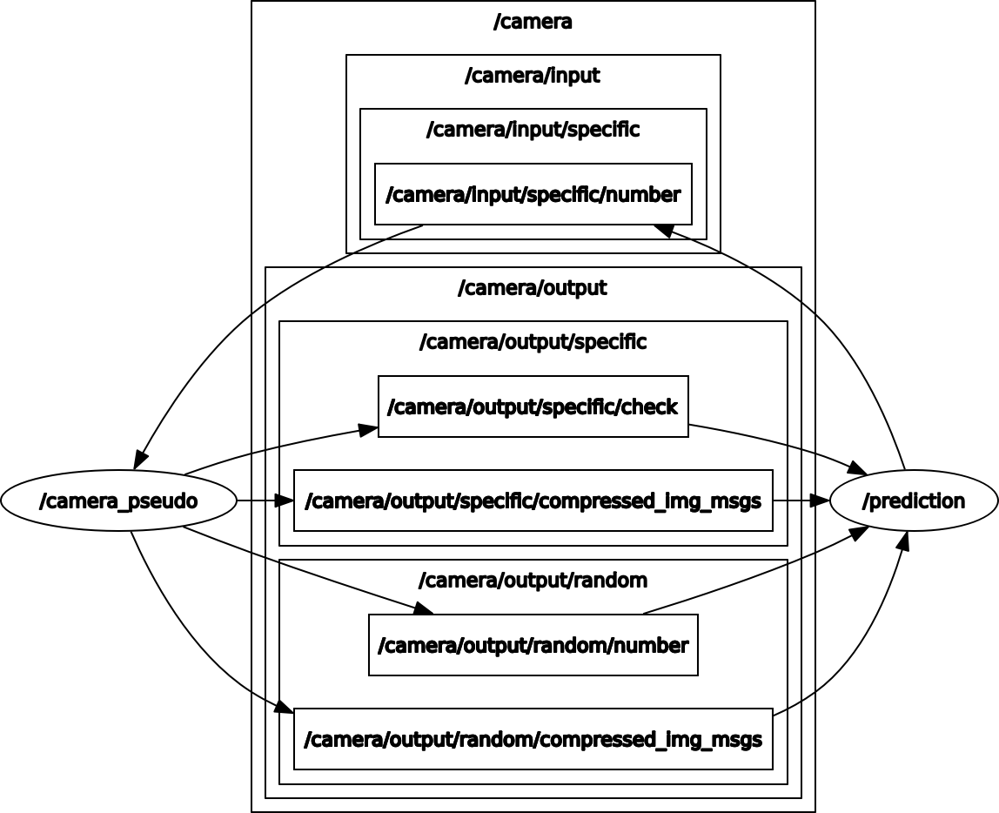

# Lösung der Aufgabe 1 - Excercise ROS + Supervised Learning

Exercise ROS + Supervised Learning ist ein Pflichtbeleg im Kurs "K.I. in der Robotik" im  B. Sc. Angewandte Informatik an der Hochschule für Technik und Wirtschaft Berlin. 

## Supervised Learning und Publisher/Subscriber in ROS

Als Modell wird ein CNN (Convolutional Neural Network) auf dem MNIST Datensatz trainiert. 

Der Datensatz besteht aus 60.000 Bildern (handgeschriebene Zahlen (0-9)) in 2D in der Größe (28,28,1).

Als Framework wird die Keras API mit TensorFlow Backend verwendet.

Das Modell hat folgende Architektur:

~~~~
model = Sequential()
model.add(Conv2D(filters=32,
                 kernel_size=(3, 3),
                 activation='relu',
                 input_shape=input_shape))
model.add(Conv2D(filters=64,
                 kernel_size=(3, 3),
                 activation='relu'))
model.add(MaxPooling2D(pool_size=(2, 2)))
model.add(Dropout(rate=0.25))
model.add(Flatten())
model.add(Dense(units=128,
                activation='relu'))
model.add(Dropout(rate=0.5))
model.add(Dense(units=num_classes,
                activation='softmax'))
~~~~
Das Modell verwendet für das *Feature Learning*: 

- 2 Convolutional Layern, jeweils mit Kernel 3x3 und ReLU als Aktivierungsfunktion
- MaxPooling Layer
- Dropout als Regulierungsverfahren

Für die *Classifizierungsphase* werden 2 FullyConnected Layer (`Dense`) mit Dropout verwendet.

Das Parameter `input_shape` muss bei den Vorhersagen in `Prediction.py` auch berücksichtigt werden. Wenn das Bild als BxHxT betrachtet wird, so ist `input_shape` für ein Exemplar (28,28,1).

Nach dem Training wird das Modell als `mnist_cnn.hdf5` abgespeichert.

## Nodes und Topics

Die Knoten komminzieren über verschiedene Topics und immer bezüglich einer <u>spezifischen</u> (`../specific/..`) oder einer <u>zufälligen</u> (`../random/..`) Zahl. 

Zwei Knoten sind im System aktiv:

- **CameraPseudo** (`CameraPseudo.py`)

  Der Node CameraPseudo verwendet die Bilder aus dem MNIST-Datensatz und ist sowohl *Publisher*, als auch *Subscriber*. 

  - Feste Zahl:
    - `/camera/output/specific/compressed_img_msgs` (Publisher): Hier werden Bilder im komprimierten Format durch CameraPseudo veröffentlicht. Das Format (`CompressedImage`) ist ROS-spezifisch und wird durch die Bibliothek `cv_bridge` erzeugt. In diesem Topic wird das Bild zu einer spezifischen Zahl veröffentlicht. 
    -  `/camera/input/specific/number` (Subscriber): Hier bekommt CameraPseudo die Vorhersage vom Prediction-Knoten.  Sie verifiziert anhand der Bilderlabels, ob die Vorhersage zutrifft.
    - `/camera/output/specific/check` (Publisher): Hier veröffentlicht die Kamera das Ergebnis als boolschen Wert aus der Überprüfung im Topic `/camera/input/specific/number`.
  - Random Zahlen:
    - `/camera/output/random/compressed_img_msgs`: Hier veröffentlicht CameraPseudo zufällige Bilder im ROS-Format `CompressedImage`.
    - `/camera/output/random/number`: Hier veröffentlicht CameraPseudo das Label zum veröffentlichten zufälligen Bild.

- **Prediction** (`Prediction.py`):

  Der Node `Prediction` subskribiert alle Topics, für die `CameraPseudo` *Publisher* ist. Der Knoten soll Vorhersagen über die Bilder treffen und verwendet dafür das vortrainierte Modell `mnist_cnn.hdf5`. Um solche Aktionen auszuführen verwenden Subscribers sogenannte *callback* Funktionen.

  Im folgenden wird das Verhalten von Prediction beschrieben.

  Für das *spezifische* Bild:

  - Prediction empfängt das Bild im Topic `/camera/output/specific/compressed_img_msgs` (Subscriber). Zur Verarbeitung der Daten wird die *callback* `callback_img_specific` verwendet.
    1. Zuerst muss das ROS-Format in eine CV2-Bild umgewandelt werden. 
    2. Das Modell liefert eine Vorhersage dazu als One-Hot-Encoded Vektor zurück.
    3. Über die *numpy*-Methode `argmax` wird die Vorhersage zu einer Zahl  (`Int32`) konvertiert.
    4. Diese Zahl wird im Topic `/camera/input/specific/number` (Publisher) veröffentlicht und von CameraPseudo empfangen (s. o.).
  - Prediction subskribiert im Topic `/camera/output/specific/check`. Hier empfängt der Node die Überprüfung von PseudoCamera als boolschen Wert und gibt eine entsprechende Nachricht in der Console aus.

  Für *zufällige* Bilder:

  - Prediction subskribiert im Topic `/camera/output/random/compressed_img_msgs`. Wie für das speizifische Bild wird das Bild auch hier zu einer Zahl umgewandelt. Die ausgelesene Zahl wird in einer globalen *Liste* gespeichert.
  - Subskribiert das Topic `/camera/output/random/number`, wo er das wahre Label zum Bild empfängt.
    - Prediction liest aus der Liste seine Vorhersage,  vergleicht sie mit dem wahren Label und gibt das Ergebnis in der Console aus.

  

## Rate und Geschwindigkeit

Damit Prediction in der Lage ist, eine Vorhersage zu einer zufälligen Zahl zu treffen und sie dem wahren Label gegenüber zu überprüfen, wird eine Liste verwendet.

Da diese drei Schritte langsamer ausgeführt werden, als CameraPseudo Bilder und Labels veröffentlicht, wurde der Wert vin `PUBLISH_RATE` in CameraPseudo sowie der Looping-Rate von Prediction angepasst.

Die besten Ergebnisse ergaben sich mit einem `PUBLISH_RATE` von 0.3 hz und `rospy.Rate(1).sleep()` in Prediction.

## ROS Graph (rqt_graph)

Über den Befehl `rqt_graph` ist es möglich, das ROS-System zu visualisieren.

Das System mit allen Knoten und allen input und output Topics sieht folgendermaßen aus:

## Programm starten	

Um das Programm zu verwenden, sind folgende Befehle notwendig:

1. Vom Wurzelverzeichnis der Catkin-Workspace `catkin_make` ausführen, um alle Packages zu generieren
2. `source devel/setup.bash` um die Workspace zu verwenden
3. Mit `roslaunch` die lauch-Datei verwenden, um das ganze System zu starten.

Ein Skript `start.sh` ist in der Repo verfügbar, um diese 3 Schritte zu automatisieren.
